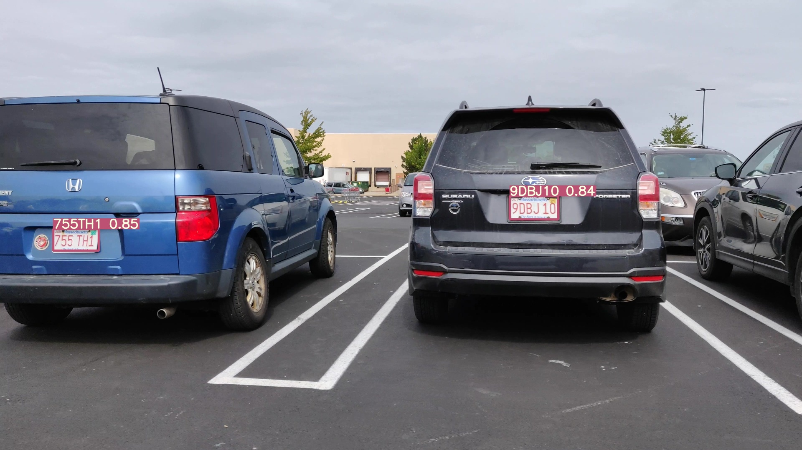
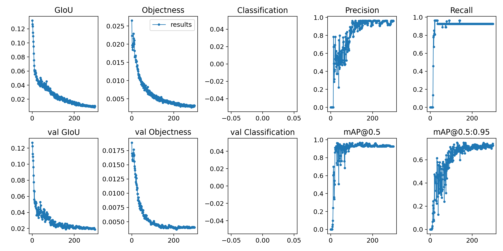

# ALPR
## An Automatic License Plate Recognition Algorithm using YOLOv5 and EasyOCR. [](https://github.com/YuTingChow/ALPR/blob/master/LICENSE)


## Sample Output


The algorithm is divided into 2 stages, first locating license plates (bounding boxes) then readout the characters.
Output: readout character, license plate confidence level 

# Introduction 
This project is aimed at US License Plate Recognition. 
The YOLOv5 framework is adopted from https://github.com/ultralytics/yolov5 and trained using images from OpenALPR benchmark dataset https://github.com/openalpr/benchmarks.

For EasyOCR https://github.com/JaidedAI/EasyOCR, default settings and weights is used.

# Requirements

Python 3.8 or later with all [requirements.txt](https://github.com/YuTingChow/ALPR/blob/master/requirements.txt) dependencies installed, including `torch>=1.6`. To install run:
```bash
$ pip install -r requirements.txt
```

# Inference 

Inference can be run on images or videos. Results are saved to './inference/output'

```bash
$ python ./src/detect.py --source  file.jpg  # image 
                            file.mp4  # video
                            path/  # directory
                            path/*.jpg  # glob
```

To run inference on images in the './tests/images' folder:
```bash
$ python ./src/detect.py --source ./tests/images/ --weights best.pt --conf 0.5
```
# Custom Training

You can train the network from scratch with your own data as follows:
```bash
$ python ./src/train.py --data ./data/licensePlate.yaml --cfg models/yolov5s.yaml --weights '' --batch-size 16
```
You just need to replace the data path to the training and validation set in `licensePlate.yaml`.



For the details of training, please refer to https://github.com/ultralytics/yolov5.